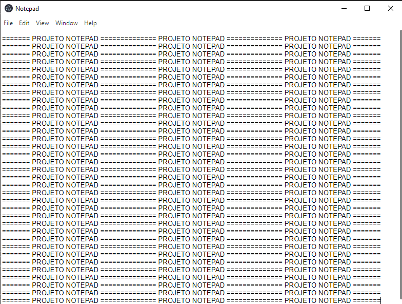

<h1 align="center">NOTEPAD</h1>

<p align="center">


</p>

> 🔔 ***Nota:** Esse projeto pode ter alterações no futuro.*

### Tópicos

- [Descrição do projeto](#descrição-do-projeto)
- [Tecnologias](#tecnologias)
- [Projeto em funcionamento](#projeto-em-funcionamento)
- [Como utilizar o projeto](#como-utilizar-o-projeto)
- [Colaboradores](#colaboradores)

## Descrição do projeto

Este projeto recria o Notepad (Bloco de Notas) do Windows. O objetivo é simular a experiência do Notepad clássico, com interface simples e intuitiva, porém funcionando em qualquer sistema operacional (Windows, macOS e Linux).

## Tecnologias

<div width="140px">
    
</div>

## Projeto em funcionamento

Clique na imagem abaixo para assistir ao tutorial em vídeo!

[](semvideo.com)

**Descrição**: Este vídeo cobre todo o processo para visualizar o projeto em funcionamento, do início ao fim.

## Como utilizar o projeto

```
< INSTALADORES >
npm install
npm install electron --save-dev

< INICIADORES >
cd ./notepad
npx electronmon .
```

> **1.** Abra o projeto no VsCode.<br>
> **2.** Instale o npm no terminal com o comando `npm install`.<br>
> **3.** Rode o `npm install electron --save-dev` no terminal da IDE.<br>
> **4.** Rode `npx electronmon .` no terminal para abrir o notepad.<br>

## Colaboradores

| [<br><sub>Kauê Bertaze de Oliveira</sub>](https://github.com/KaueTTS)<br><sub>Developer Full Stack</sub> |
| :---:
